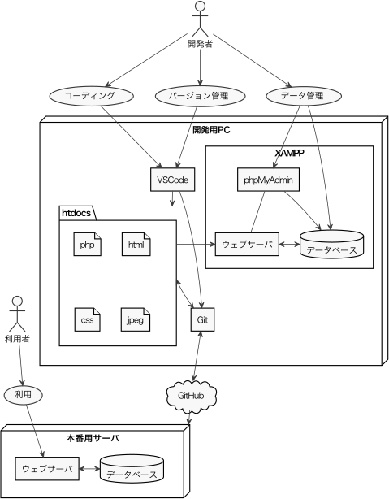

# PM演習

この演習ではウェブアプリケーション（ウェブアプリ）を作ります．
この資料では，ウェブアプリについての知識と，それを実現する技術を身に付けることが目標です．

初めてのウェブアプリなので，知識も技術も最低限のものだけにしましょう．
とはいえ，学ぶことはたくさんあります．

## 構築システムの概要

構築するシステムの概要を示します．（最初は何のことかわからないかも）

## 開発・本番環境の概要

開発・本番環境の概要を示します．（最初は何のことかわからないかも）

## 詳しい説明

以下は一般論です．
具体的な学び方は研究室の教員の指示に従ってください．

1. [ウェブアプリとは何か](docs/introduction.md)
1. [準備](docs/setup.md)
1. PM実験の復習
    1. [HTMLファイル](docs/static-file.md)
    1. [スタイル指定](docs/style.md)
1. サーバについての理解
    1. [ウェブサーバ](docs/apache.md)
    1. [データベース](docs/database.md)
    1. [データベースの操作](docs/sql.md)
    1. [PHP](docs/php.md)（2回目以降に読む）
    1. [PHPとMySQL](docs/phpmysql.md)（2回目以降に読む）
1. [ウェブアプリのパターン](patterns/)
1. [本番サーバへのデプロイ](docs/deployment.md)
