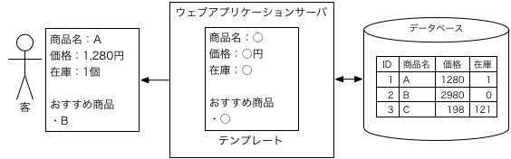

# データベース

## リレーショナルデータベース

ウェブページをテンプレートにしておいて，データはページに直接書かず，データベースから持ってくるようにします．
このように，ページとデータを分離しておくのは大事な原則です．

オンラインショッピングサイトならこんな感じ．

この図にはテーブル（表）が一つしかありませんが，実用的なデータベースは，複数のテーブルからなるのが一般的です．（ショッピングサイトに他にどんなテーブルが必要かわかるでしょうか．）

データを複数のテーブルを組み合わせて管理するようなデータベースを，リレーショナルデータベースといいます．
データベースには他の形式もありますが，リレーショナルデータベースが基本です．

とはいえ，この演習で作るのは初めてのウェブアプリなので，テーブルは一つでかまいません（0はダメです）．

## テーブルの設計

上の図のデータベースのテーブルはこんな感じです．

ID|商品名|価格|在庫
-:|--|-:|-:
1|A|1280|1
2|B|2980|0
3|C|198|121

データベースのテーブルでは，列ごとにデータの型を決めておかなければなりません．
上のテーブルなら，IDと価格と在庫は「整数」，商品名は「文字列」です．

型の種類はたくさんありますが，この演習では，**整数（int），実数（double），文字列（varchar），日時（datetime）** の4種類だけを使うことにしましょう．

さらに，サンプルプログラムの修正を少なくするために，

* IDの列名：`id`（IDはテーブルに必ず1個ということにします．）
* 整数の列名：`intA`，`intB`，`intC`，・・・
* 実数の列名：`doubleA`，`doubleB`，`doubleC`，・・・
* 文字列の列名：`varcharA`，`varcharB`，`varcharC`，・・・
* 日時の列名：`datetimeA`，`datetimeB`，`datetimeC`，・・・

ということにしましょう．
上のテーブルはこんな感じになります．

id|varcharA|intA|intB
-:|--|-:|-:
1|A|1280|1
2|B|2980|0
3|C|198|121

このテーブルを`table1`と呼びましょう（この演習ではテーブルは一つで十分）．

さらに，ちょっとまぎらわしいのですが，この演習で使うデータベース（管理システム）であるMySQLでは，テーブルの入れ物をデータベースといいます．
そのデータベースの名前は`mydb`ということにします．
（`mydb`の中に一つのテーブル`table1`があるということです．）

こういう名前の付け方はわかりにくくなるのでよくないのですが（就職先でやらないように），この演習では，サンプルプログラムの修正を少なくすることを重視します．

テーブルを設計するときには，列名，型，内容を整理してください．
上のテーブルならこんな感じ．

列名|型|内容
--|--|--
id|int|ID
varcharA|varchar(40)|商品名（40文字以内）
intA|int|価格
intB|int|在庫

（細かいこと）実数は整数を含んでいると思うかもしれませんが，計算の効率や正確性が悪いので，小数点以下が出てくる可能性がないなら，実数ではなく整数を使います．
日時は文字列で表現できると思うかもしれませんが，そういうことをしてはいけません．計算が大変になります．「20200524」の100日後を計算とか，実装したくないでしょう．

**このページには作業はありません．**