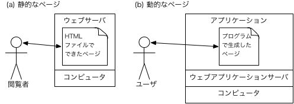

# ウェブアプリとは何か

ウェブアプリは，ウェブブラウザ（ブラウザ）で動くアプリのことです．
PM実験で作ったウェブページとは，「動く」という点で違っています．

(a) 静的なページ：PM実験で作ったウェブページです．
HTMLで書いておいたことが表示されるだけです．
つまり，内容は静的です（固定）．

(b) 動的なページ：この演習で作るウェブアプリです．
プログラムで生成した内容を表示します．
つまり，内容は動的です（固定ではない）．

**要するに，これからプログラムでウェブページを作るということです．**