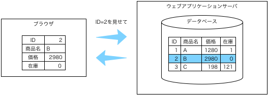

# 特定のデータの表示（実装）

URLで指定した，テーブル内の特定のデータを表示します．



## URLの仕様

最初にURLの仕様を決めます．

ここではURL（のパス以降）を「table1.php?id=番号」とします．
localhostなら，http://localhost/table1.php?id=2 でID=2のデータが表示されるようにするのです．

## 処理手順

手順は次のとおりです．

1. URL中のidの取得
1. SQLの実行
1. 結果の処理

### 1. URL中のidの取得

URL中の「id=番号」の番号は，次のように取り出します．

```php
$id = $_GET['id']; # URLからIDを取得
```

### 2. SQLの実行

テーブル`table1`の全データを取り出すSQLは「`select * from table1 where id = 番号`」です（[データベースの操作](sql.md)のC3）．
この番号の部分は実行時に決まるので，穴埋めにします．

```sql
SELECT * FROM table1 where id=穴
```

ふつうは次のように書きます．

```sql
SELECT * FROM table1 where id=:id
```

こういう穴埋めSQLを使うプログラムは次のようになります．

```php
require 'db.php';                                # 接続
$sql = 'SELECT * FROM table1 where id=:id';      # 穴埋めSQL文
$prepare = $db->prepare($sql);                   # 準備
$prepare->bindValue(':id', $id, PDO::PARAM_STR); # 番号の埋め込み
$prepare->execute();                             # 実行
$result = $prepare->fetchAll(PDO::FETCH_ASSOC);  # 結果の取得
```

補足：「`$sql = "SELECT * FROM table1 where id={$id}";`として埋め込めば簡単と思うかもしれませんが，この書き方はいけません．SQLインジェクションという攻撃を受けます．（と言いながら，$idを文字列のままにして`PDO::PARAM_STR`で埋め込んでごめんなさい．）

### 3. 結果の処理

結果は全件表示の場合と同じように処理できます．
ここでは，図と同じように縦に表示させます．

```php
foreach ($result as $row) {
  $id       = h($row['id']);
  $varcharA = h($row['varcharA']);
  $intA     = h($row['intA']);
  $intB     = h($row['intB']);
  echo '<table>' .
    "<tr><th>ID</th><td>{$id}</td></tr>".
    "<tr><th>商品名</th><td>{$varcharA}</td></tr>".
    "<tr><th>価格</th><td>{$intA}</td></tr>".
    "<tr><th>在庫</th><td>{$intB}</td></tr>".
    '</table>';
}
```

補足：結果は1件なので`foreach`を使う必要はないのですが，構文が増えると難しいと感じる人がいるかもしれないので，全件表示と同じ構文を使っています．

**以上のコードを含む[`table1.php`](table1.php)を作り，http://localhost/table1.php?id=2 やhttp://localhost/table1.php?id=3 でデータが表示されることを確かめてください．**

補足：データがない場合にはないことがわかるようなページを返すべきなのですが，ここではそれは省略しましょう．

## 応用

特定のアイテムをURLで指せるようになると，全データの表示結果をリンクにできます．[全データ表示（実装）](pattern-table.md)に（応用）として書いておきました．