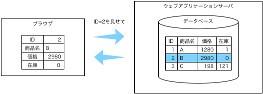
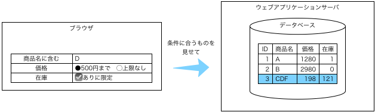

# ウェブアプリのパターン

## やらなくてよいこと

みなさんがウェブで見るものは，すべて技術的には可能なことです（だから見えているわけで）．
しかし，初めて作るウェブアプリでやれるかというと，なかなか難しいこともあります．

この演習では，最初はあまり技術的な挑戦をしないでおきましょう．
ウェブで拾ったよくわからないコードをつなぎ合わせるよりは，ちゃんと理解したことを積み上げていった方がいいと思います．
（もちろん，挑戦してもいいのですが，最低限のウェブアプリが完成してからのオプションという扱いにしておくことを勧めます．）

* ログイン機能：ユーザを分けたいときは，2種類のページを作ってしまいましょう．（とはいえ，要望があったので，応用例として紹介します．）
* 画像のアップロード：画像を使いたいときは，アップロード機能を実装するのではなく，ファイルとしてあらかじめ用意しておいて，ファイル名だけデータベースで管理しましょう．

## パターン集

次のようなパターンを組み合わせてウェブアプリを作りましょう．
ここにないものが欲しければ，矢吹に言ってください．
初めてのウェブアプリでも大丈夫そうなものなら，（応用）としてサンプルを追加します．

1. 全データの表示
1. 特定のデータの表示
1. データの追加
1. 画像の表示
1. （応用）詳細検索
1. （応用）ログイン

簡単に紹介します．

### 全データの表示

テーブル内のデータをすべて表示します．

実装方法を[全データ表示（実装）](pattern-table.md)で解説します．（2回目以降に読む）

### 特定のデータの表示

テーブル内の特定のデータを表示します．

実装方法は[特定のデータの表示（実装）](pattern-id.md)で解説します．（2回目以降に読む）

### データの追加

フォームから送られたデータをデータベースに登録します．

実装方法は[データの追加（実装）](pattern-post.md)で解説します．（2回目以降に読む）

### 画像の表示

データベースのアイテムに画像を対応させます．

実装方法は[画像の管理（実装）](pattern-images.md)で解説します．（2回目以降に読む）

### （応用）詳細検索

文字列，ラジオボタン，チェックボックスを組み合わせた検索フォームを作ります．

実装方法は[詳細検索（実装）](pattern-detail.md)で解説します．（2回目以降に読む）

### （応用）ログイン

ログイン機能によって次の3種のページを実現します．

* 誰でも見られるページ
* ログインした人が見られるページ
* 管理者だけが見られるページ

実装方法は[ログイン（実装）](pattern-login.md)で解説します．（2回目以降に読む）

**このページに作業はありません．**