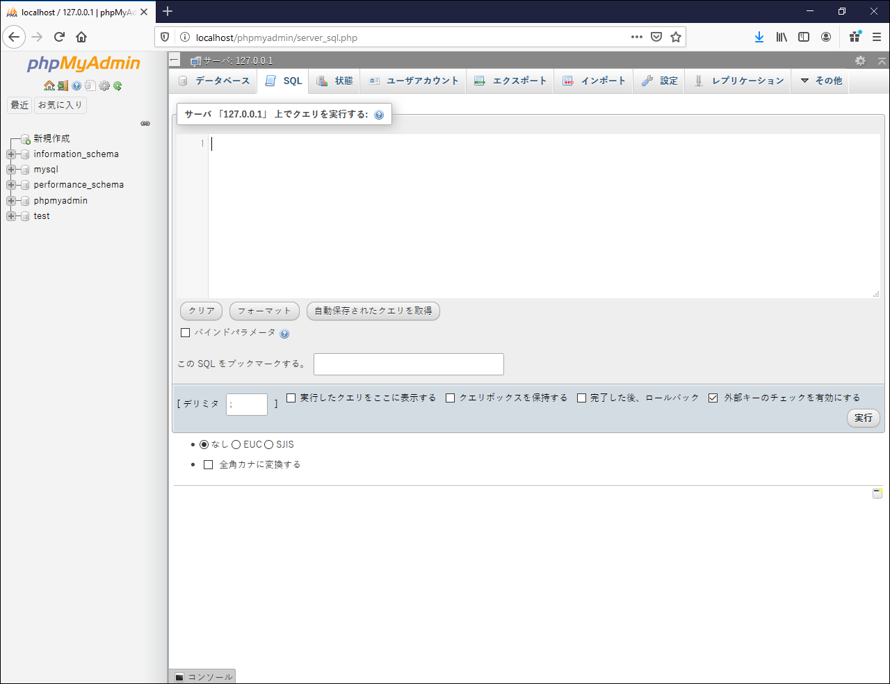
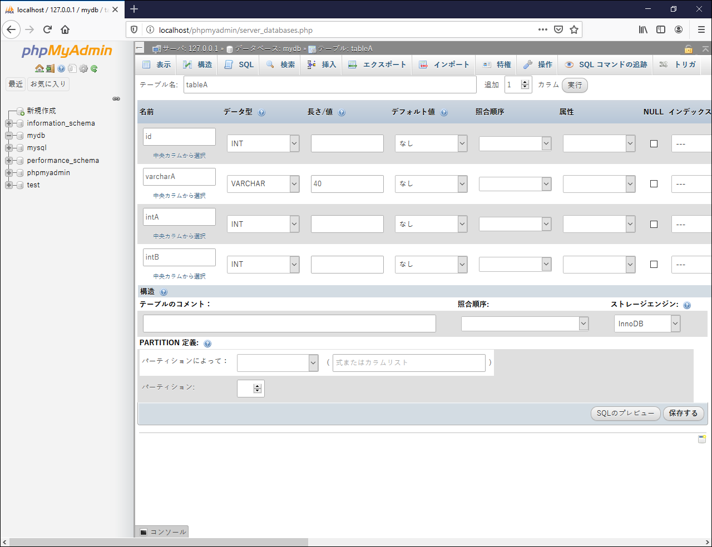

# データベースの操作

## SQL

データベースはSQLという言語を使って操作します．

SQLはとても強力な言語で，知っているとデータ処理の仕事の効率はかなり上がります．（卒業して数年経った元学生から，「SQLを学ぶいい教科書ありませんか？」と聞かれたことがあります．）

とはいえ，この演習でSQLをちゃんと学ぶ時間はありません．
次の10個のSQL文だけでなんとかしましょう．

* 管理系（A1～A5の5個）（いつも同じ．コピペでOK）
* デーブル作成（Bの1個）（これも管理系だが，コピペは不可）
* 操作系（C1～C5の5個）

実行方法は後で説明することにして，まずはSQL文を見ていきます．

補足：SQL文は，[memo.sql](memo.sql)のようなテキストファイルに保存しておくと，やり直すときに便利です．

### 管理系（A1～A5の5個）

データベース（テーブルの入れ物）`mydb`の中に，テーブル`tableA`を作る（直前）までを例に説明しましょう．

この部分はこの演習では変わらないので，自分のPCで1回だけ，コピペして実行すればいいです．
データベースを作り直したいという場合は再実行してください．

```sql
# (A1)mydbというデータベースが既にあるなら削除する（危険なSQL）．
drop database if exists mydb;

# (A2)mydbというデータベースを作る．
create database mydb charset=utf8mb4;

# (A3)ユーザ名testuser，パスワードpassでmydbにアクセスできるようにする．
grant all on mydb.* to testuser@localhost identified by 'pass';

# (A4)mydbを使うことを宣言する．
use mydb;

# (A5)tableAというテーブルが既にあるなら削除する（危険なSQL）．
drop table if exists tableA;
```

### テーブル作成（Bの1個）

次のようなテーブルを作ります（再掲）．

列名|型|内容
--|--|--
id|int|ID
varcharA|varchar(40)|商品名（40文字以内）
intA|int|価格
intB|int|在庫

テーブルを作るためのSQL文は，コピペというわけにはいきません．
テーブルの仕様にあわせて修正が必要です．
（たとえば，varcharBを追加するなら，どういうSQL文になるかわかりますか？）

```sql
# (B)テーブルを作る．
create table tableA (
  id int primary key auto_increment, # ここはいつも同じ
  varcharA varchar(40) not null,
  intA int not null,
  intB int not null # 最後にはカンマがないことに注意．
);
```

### 操作系（C1～C5の5個）

```sql
# (C1)データを作成する．
insert into tableA (id, varcharA, intA, intB) values
(1, 'A', 1280, 1),
(2, 'B', 2980, 0),
(3, 'C', 198, 121);

# (C2)すべてのデータを読み込む．
select * from tableA;

# (C3)IDを指定してデータを読み込む．
select * from tableA where id=2;

# (C4)IDを指定してデータを更新する．
update tableA set varcharA='D', intA=200 where id=3;

# (C5)IDを指定してデータを削除する．
delete from tableA where id=1;

# 結果の確認（C2と同じ）
select * from tableA;
```

補足：データの操作方法を学ぶときは，CRUD（create, read, update, delete）に分けて整理するといいでしょう．

## SQLの実行

SQLの実行方法を二つ紹介します．

* コンソール
* phpMyAdmin

コンソールを使うのが手軽ですが，気の弱い人は，phpMyAdminを使いましょう．

### コンソール（推奨）

Windowsのスタートボタンを右クリックして，Windows PowerShell（管理者でない）を起動します．
コマンドプロンプトでもかまいません．

MySQLのクライアントプログラムを起動し，次のコマンドを実行します（`root`はMySQLの管理者のこと）．

```bash
c:
/xampp/mysql/bin/mysql.exe -uroot
```

次のようなエラーメッセージが表示されたら，XAMPP Control PanelでMySQLが動いていることを確認してください．

```
ERROR 2002 (HY000): Can't connect to MySQL server on 'localhost' (10061)
```

正常に起動すれば，コンソールに次のように表示されます．

```
Welcome to the MariaDB monitor.  Commands end with ; or \g.
Your MariaDB connection id is 11
Server version: 10.4.11-MariaDB mariadb.org binary distribution

Copyright (c) 2000, 2018, Oracle, MariaDB Corporation Ab and others.

Type 'help;' or '\h' for help. Type '\c' to clear the current input statement.

MariaDB [(none)]>
```

SQL文をコピペして実行します．
終わるときはCtrl-c．

### phpMyAdmin

phpMyAdminは，MySQLを操作するためのウェブアプリです．

http://localhost/phpmyadmin/ で利用します．

SQLタブをクリックするとこんな画面になるので，SQL文を貼り付けて実行します．（データベースmydbを作ったのに左側に出てこないというときは，ページを再読込します．）



phpMyAdminにはSQLを実行するためのSQLタブ以外にも，いろんなUIが用意されています．
それらを使えば，SQLを書けなくてもMySQLを操作できます．
しかし，ここで紹介したような最低限のSQL文を書けないと，ウェブアプリの中でデータベースを使うことはできません．
SQLがよくわからない操作はphpMyAdminでやっていいのですが，最低限のSQLは書けるようになりましょう．

**SQL文の例の「結果の確認」ができたら終了**

#### オプション（やってみたい人だけ）

先に書いたように，最低限のSQLを書けないとウェブアプリは作れないのですが，「難しそう，無理」と思う人は，SQL文を書かずに，やってみるといいかもしれません．

phpMyAdminで以下の手順を実行してみましょう．（詳細は割愛．GUI操作の説明を書くのはかなり大変なので．）

1. データベースmydbを削除する．
1. データベースmydbを作る．
1. テーブルtableAを作る．



4. テーブルtableAを選択→挿入タブでデータを追加する．