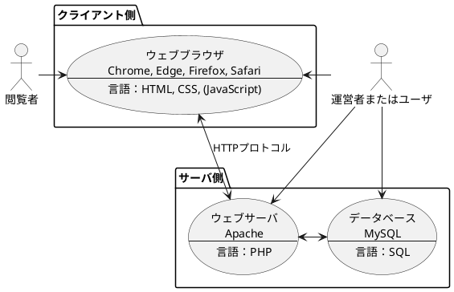

```puml
@startuml

actor 閲覧者
actor 運営者またはユーザ

package クライアント側 {
usecase ブラウザ as "ウェブブラウザ
Chrome, Edge, Firefox, Safari
--
言語：HTML, CSS, (JavaScript)"
}

package サーバ側 {
usecase ウェブサーバ as "ウェブサーバ
Apache
--
言語：PHP"

usecase データベース as "データベース
MySQL
--
言語：SQL"
}

閲覧者 -> ブラウザ
ブラウザ <- 運営者またはユーザ
運営者またはユーザ --> ウェブサーバ
運営者またはユーザ --> データベース
ブラウザ <--> ウェブサーバ : HTTPプロトコル
ウェブサーバ <-> データベース
@enduml
```