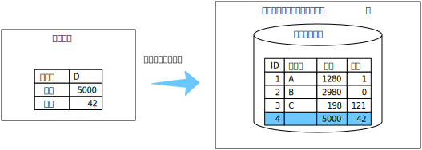

# データの追加（実装）

フォームから送られたデータをデータベースに登録します．



## フォームの作成

HTMLのform要素でデータを入力するためのUIを作ります．
次のことが大事．

* form要素のaction属性には送信先のPHPを書く（まだ作っていない）．
* form要素のmethod属性は`post`（検索なら`get`）．
* input要素のname属性にはわかりやすい名前を付ける．
* input要素のvalue属性は不要だが，テスト用にデータを入力するのが面倒なためつかっている．

```html
<form action="post.php" method="post">
  <table>
    <tr>
      <th>商品名</th>
      <td><input name="varcharA" type="text" value="D"/></td>
    </tr>
    <tr>
      <th>価格</th>
      <td><input name="intA" type="text" value="5000"/></td>
    </tr>
    <tr>
      <th>在庫</th>
      <td><input name="intB" type="text" value="42"/></td>
    </tr>
  </table>
  <input type="submit" value="送信" />
  <input type="reset" value="リセット" />
</form>
```

**上のフォーム要素を含む[post.html](post.html)を作り，http://localhost/post.html でフォームが表示されることを確かめてください．**

補足：入力を必須にしたり，数字しか入力できないようにしたりすることもできるのですが，今はやらないでおきましょう．やったとしても，それは操作性向上のためのものであり，データのチェックにはなりません（偽装できるから）．データのチェックはサーバ側で行います．

## 処理手順

手順は次のとおりです．

1. 送信されたデータの取得
1. SQLの実行

## 1. 送信されたデータの取得

上で作ったフォームのデータは，`post.php`に送られます（action属性値）．
`post.php`では，送られてきたデータを，name属性値を使って取り出します．

```php
$varcharA = $_POST['varcharA']; # 商品名
$intA = $_POST['intA'];         # 価格
$intB = $_POST['intB'];         # 在庫
```

## 2. SQLの実行

テーブル`table1`にデータを追加するSQLは「`insert into table1 (varcharA, intA, intB) values (:varcharA, :intA, :intB)`」です（[データベースの操作](sql.md)のC1）．この製品名，価格，在庫の部分（コードの`:varcharA`, `:intA`, `:intB`）に，先に取り出したデータを埋め込んで実行します．

```php
require 'db.php'; # 接続
$sql = 'insert into table1 (varcharA, intA, intB) values (:varcharA, :intA, :intB)';
$prepare = $db->prepare($sql); # 準備

$prepare->bindValue(':varcharA', $varcharA, PDO::PARAM_STR); # 埋め込み1
$prepare->bindValue(':intA', $intA, PDO::PARAM_STR);         # 埋め込み2
$prepare->bindValue(':intB', $intB, PDO::PARAM_STR);         # 埋め込み3

$prepare->execute(); # 実行
```

**以上のコードを含む[`post.php`](post.php)を作り，http://localhost/post.html からデータを追加できることを確かめてください．確かめるには，http://localhost/show-all2.php を使うといいでしょう．**