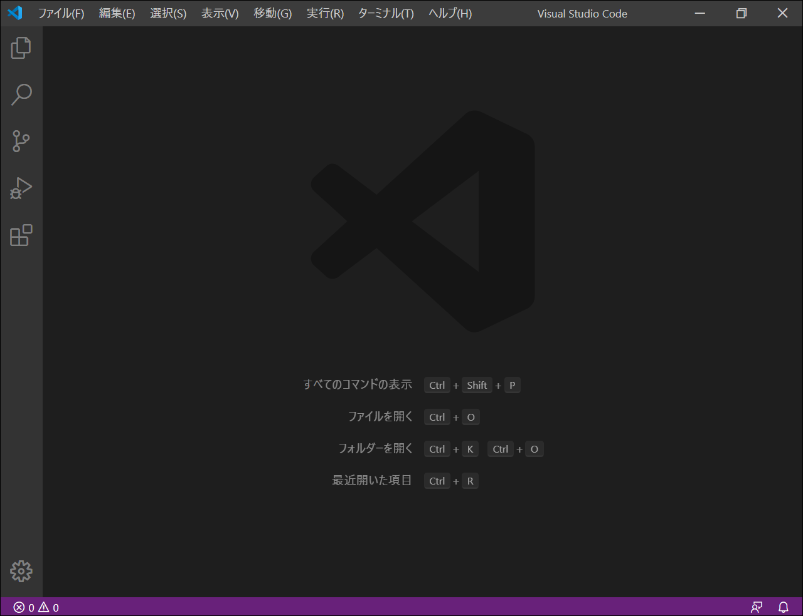
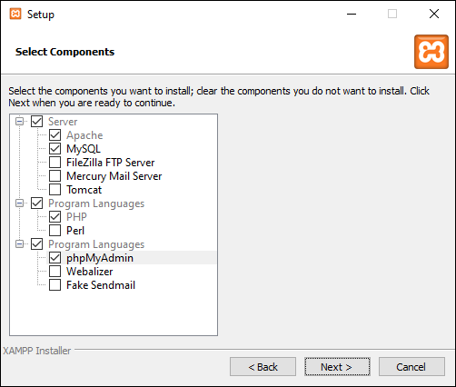
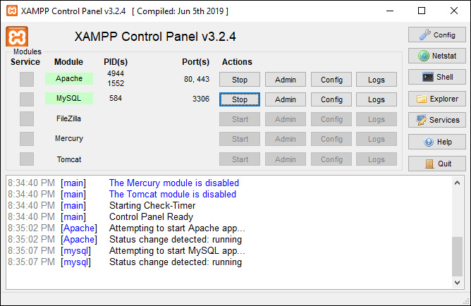
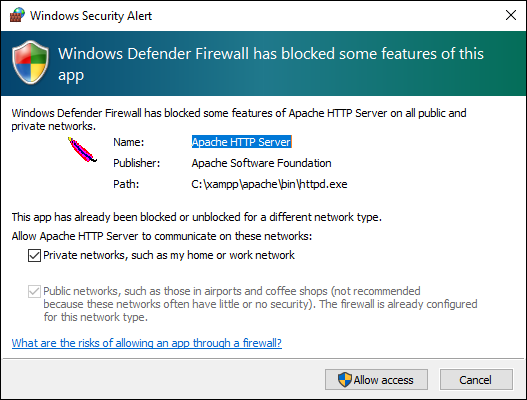
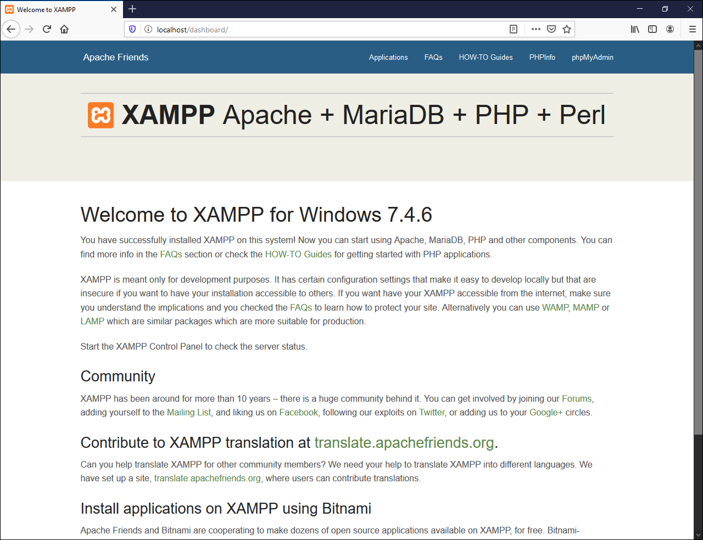

# 準備

## 必要なもの

### サーバ

PM実験のウェブサイトは，ウェブサーバを使って公開しました．
ウェブサーバは，ウェブページを公開するためのプログラムです．

この演習のウェブアプリも，ウェブサーバを使って公開します．
このウェブサーバは，HTMLファイルを公開するだけでなく，プログラムも動かせます．
そういうウェブサーバを，ウェブアプリケーションサーバといいます．

ウェブアプリケーションサーバの作り方はいろいろありますが，この演習では，Apache＋PHP＋MySQLという構成にします．

### 開発環境

PM実験で開発に必要だったのは次のものです．

* ブラウザ
* テキストエディタ
* Gitクライアント

テキストエディタでHTMLファイルを作り，ブラウザで表示して確かめ，Gitクライアントでアップロードするという手順でした．

この演習では，これらに加えて，サーバが必要になります．
プログラムを実行して動作確認しながら開発するからです．

* Apache
* PHP
* MySQL

三つもありますが，まとめてインストールできるので，心配しなくていいです．

## インストール

順番に入れていきます．

ブラウザはすでにあるでしょう．Edge, Chrome, Firefox，・・・なんでもいいです．

テキストエディタはVisual Studio Code（VSCode）を入れましょう．
すでに入っていると思いますが，入ってない人はググって．
インストール直後はユーザインタフェース（UI）が英語ですが，日本語にもできます．
「vscode 日本語化」でググって．

Gitクライアントはあとで必要になったときに改めて．

Apache＋PHP＋MySQLは，[XAMPP](https://www.apachefriends.org)というパッケージでまとめて入れるのが簡単です．（本当は，XAMPPよりもDockerがいいのですが，今はその余裕がないので，興味がある人は全部終わってから自分で調べてください．）

macOSの人はDockerがいいと思いますが，それを説明する余裕はありません．

Windows向けのインストーラをダウンロードして実行します．
インストールはデフォルトのまま進めてかまいませんが，不要なものを入れたくない人はこんな感じ．

インストール先は`c:\xampp`のままにするのがいいでしょう．

インストールが終わったら，スタートメニュー→XAMPP→XAMPP Control Panelで，ApacheとMySQLのStartをクリックする．
両方とも緑になればOK．

アクセスを許可してよいか，こんな感じでたずねられたら許可する．

**http://localhost にアクセスして，こんな感じのページになれば準備完了．**

XAMPP Control Panelはよく使うので，スタートメニューにピン留めしておくといいでしょう．

### うまく行かない場合

* Port 80を使っているアプリが他にあるとき．Control Panelの「Netstat」をクリックして，Port 80を使っているのがhttpd.exeならいい（これがApacheのプログラム）．（Skypeを使っている人は，完全終了させてみる．）
